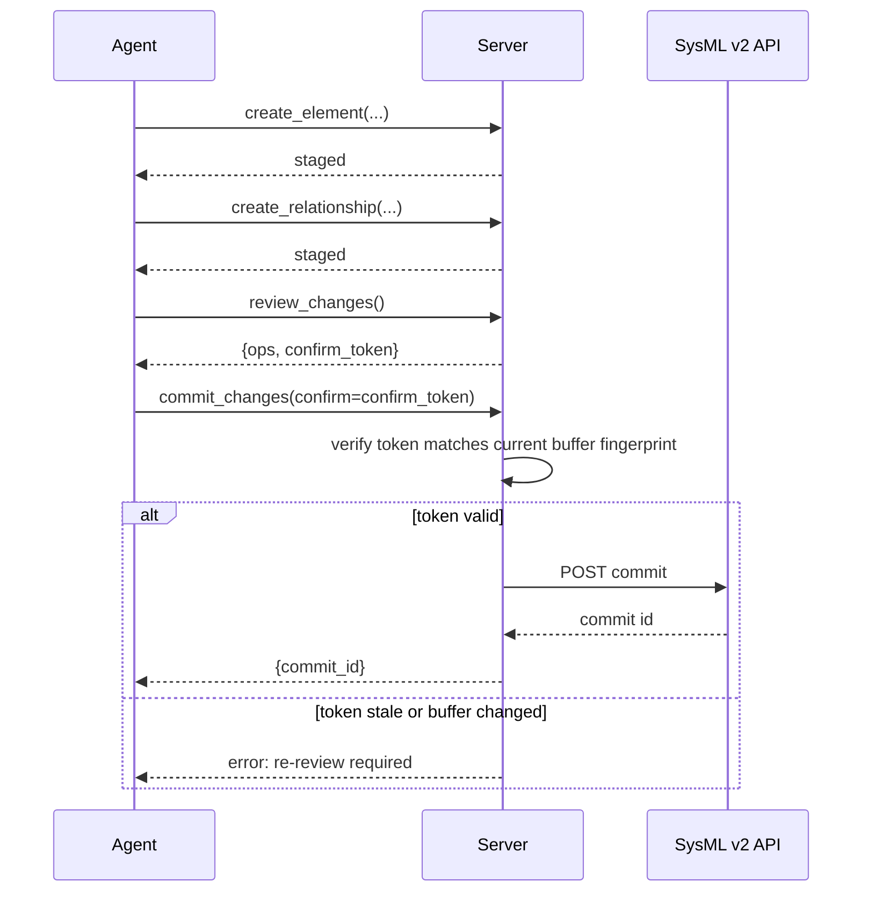

<!-- Copyright (c) 2026 JG Systems Consulting Ltd. See LICENSE. -->

# Usage

This is a task-level guide to the four workflows you will use most: exploring a model you did not build, authoring and committing a change, running one branch per agent session, and managing a project's lifecycle. Each section names the tools involved and the order to call them in. Full parameter details are in `docs/TOOL-REFERENCE.md`.

## 1. Explore a model you did not build

Every model has an entry point: its root, unowned elements. From there you walk down through owned children, or sideways through typed relationships.

1. **`get_root_elements`** returns the unowned elements at a commit. This is where you start when you have no id to work from yet.
2. **`get_children`** returns one level of owned children for a given element id, with name and type. Call it repeatedly to walk the containment tree by hand, or use `nav_traverse` to walk it automatically.
3. **`find_by_name`** looks up elements by their declared name, with an optional type filter, when you know roughly what you are looking for but not its id.
4. **`get_relationships`** returns the typed relationship elements touching a given element, in either direction or both. Use this to answer "what does this depend on" or "what depends on this."

A typical exploration session:

```
get_root_elements()                         -> [{"@id": "pkg-1", ...}]
get_children(element_id="pkg-1")            -> [{"@id": "part-1", "name": "Engine", ...}, ...]
find_by_name(name="Engine")                 -> [{"@id": "part-1", ...}]
get_relationships(element_id="part-1")      -> [{"@type": "FeatureTyping", ...}, ...]
```

All of these reads default `commit_id` to the current branch head, so day-to-day exploration rarely needs to think about commits at all. Pass an explicit `commit_id` only when you want to look at a specific point in history.

## 2. Author and commit a change

Writes never touch the server directly. `create_element`, `modify_element`, `delete_element`, `delete_subtree`, `create_relationship`, `move_element`, and `stage_batch` all stage operations into an in-process buffer. Nothing reaches the API until you commit.

1. Stage one or more changes, for example **`create_element`** to add a new part, then **`create_relationship`** to connect it to something that already exists.
2. **`review_changes`** returns the full list of staged operations plus a confirm token. Read the operations. This is the last point at which you can catch a mistake before it becomes a commit.
3. **`commit_changes`**, passing the confirm token from step 2 (and optionally a commit message). The server verifies the token still matches the buffer, then posts everything as one atomic commit.
4. If you change your mind before committing, **`discard_changes`** drops the buffer with no trace.

The confirm token is bound to a fingerprint of the exact buffer contents. If you stage anything new after calling `review_changes`, the token no longer matches and `commit_changes` refuses it: you have to review again. This is deliberate. It means a commit can never include an operation that was not shown to you first.



## 3. Branch per agent session

When more than one agent (or more than one conversation) might touch the same project at once, give each one its own branch.

1. **`create_branch`** makes a new branch from a head commit, defaulting to the session's current branch head if you do not name one.
2. **`set_branch`** retargets the current session onto that branch. It is refused if you have staged, uncommitted work, so commit or discard first.
3. Work normally: explore, stage, review, commit, exactly as in the previous two sections. Every commit you make now lands on your branch, not anyone else's.
4. **`diff_commits`** compares two commits and returns created, deleted, and modified element ids. Use it to see what changed between your branch and another one before merging.
5. **`merge_branch`** squash-merges a source branch onto a target branch as a single commit. It requires `confirm: true`, since it writes to the target. It refuses the merge outright if both branches touched the same element, rather than attempting a field-level merge; you resolve the conflict by hand and try again.

Alternatively, set the `SYSMLV2_BRANCH` environment variable at server startup if you want an entire server instance permanently pinned to one branch instead of switching branches mid-session. See `docs/configuration.md` for the tradeoffs between the two.

## 4. Project lifecycle

Most sessions work inside a single project set once, at startup, via `SYSMLV2_PROJECT`. These tools handle the surrounding lifecycle:

1. **`create_project`** makes a new project with a name and optional description. The session's own configured project does not change: you are creating something new, not switching into it.
2. **`update_project`** renames or redescribes a project. It only changes the fields you pass; anything you omit is left alone. `project_id` defaults to the session's configured project.
3. **`list_projects`** lists every project visible to the configured API endpoint, useful for confirming a create or update landed.
4. **`delete_project`** deletes a project. It requires `confirm: true`, and it refuses to delete the session's own configured project as a safety rail: you cannot accidentally delete the ground you are standing on. Deletion outcome is verified against the project list rather than trusted blindly from the response.

Project lifecycle tools are the one area where it is worth double-checking `project_id` before calling anything destructive, since `delete_project` and `update_project` both accept an explicit id that overrides the session default.
